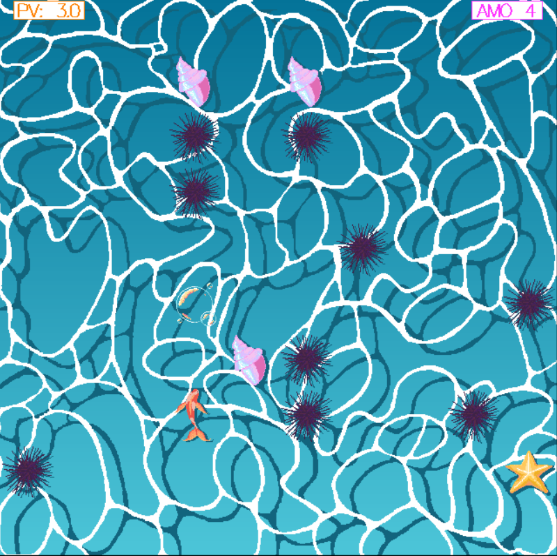

# Rapport de projet


* DUVAL Manon 21302388 
* MOUSSOKI-SAMBA Daria 21308623


### Manuel d'utilisation


Pour tester notre jeu, il faut :
- avoir installé stack sur votre terminal
- cloner sur votre machine notre repo Git : [PewPewGame](https://stl.algo-prog.info/21308623/pewpewgame)
- aller sur la branche *gloss* 
- dans votre terminal, lancez dans l'ordre les commandes suivantes : ```stack build``` , puis ```stack run```


Dans votre terminal, vous verrez apparaître un menu vous demandant de choisir un niveau de difficulté.
Tapez le numéro associé puis sur la touche Entrée. Une fenêtre s'ouvrira ensuite dans laquelle le jeu commencera !


Pour vous déplacer, utilisez les touches *z*, *q*, *s*, *d* de votre clavier.
Pour tirer, appuyez sur la barre d'espace.


**Vous incarnez un dauphin qui doit éviter les oursins !**

Votre objectif est de **survivre** aux obstacles qui défilent jusqu'à la fin du niveau.
Vous commencez avec **3 PVs**, et vous avez la possibilité de gagner +0.5PV en attrappant les **bonus étoiles de mer**.
Vous pouvez détruire les oursins en tirant des bulles devant vous. Attention, vous avez un nombre de bulles limité. En ramassant un **bonus coquillage** vous gagnez en souffle et pouvez tirer une bulle suplémentaire.



Vous pouvez alors voir vos **PV** en haut à gauche, et vos munitions bulles **AMO** en haut à droite.


### Bilan de développement

**Fonctionnalitées de base**

- boucle qui fait tourner le jeu
- affichage de l'état du jeu dans la sortie standard en ASCII (branche *stack*)
- déplacement de la joueuse dans les quatres directions
- la joueuse peut tirer un projectile
- conditions de victoire (finir le niveau en vie), condition de défaite (plus de PV)

**Extensions choisies**

- création d'une interface graphique avec Gloss
- personnalistaion de l'interface grâce à l'ajout de sprite et de décors dans Gloss
- ajout d'un bonus qui donnent 0.5 PV à la joueuse
- ajout de bonus qui ajoutent +1 munitions à la joueuse
- 3 niveaux de difficultés proposés avec une difficulté croissante


### Rapport de développement


**Architecture générale**

Notre jeu tourne principalement grâce au type *Envi* :

```haskell
data Envi = Envi {
    envEcr :: Ecran,
    envJou :: Joueuse,
    envObs :: [Obstacle],
    envTir :: [Tir],   -- liste de tirs
    envBon :: [Bonus], -- liste de bonus
    envSt  :: Statut
}
```

Ainsi que grâce à la Monade d'état *EtatJeu* qui nous permet de passer cet environnement de fonciton en fonction et donc simuler un état modifiable en Haskell.


```haskell
data Etat s a = Etat(s -> (s,a)) 

instance Functor (Etat s) where
    fmap f (Etat p1) = Etat (\x -> let (x', y) = p1 x in (x', f y))

instance Applicative (Etat s) where
    pure y = Etat (\x -> (x,y))            
    (<*>) (Etat pf) (Etat py) = Etat (\x -> let (x', f) = pf x 
                                                (x'', y) = py x' 
                                            in (x'', f y))

instance Monad (Etat s) where
    (>>=) (Etat p1) f = Etat (\x -> let (x', y) = p1 x 
                                        (Etat p2) = f y 
                                    in p2 x')
                
type EtatJeu = Etat Envi 
```


**Implémantation des extensions**


* Système de bonus

Nous avons crée un type *Bonus*, ```data Bonus = BonusPV Coord | BonusMunition Coord ```, puis ajouté à l'environnement initial une liste de ces Bonus (```envBon :: [Bonus]```). Pour permettre le défilement des bonus dans le jeu, nous avons codé la fonction récursive ```descendreBonus``` qui changent les coordonées de tous les bonus. Nous avons utilisé la même logique que dans la fonction faite en TME ```descendreObs``` qui fait descendre tous les obstacles, ainsi les bonus et les obstacles descendent à la même vitesse. 

```haskell
-- faire descendre les bonus d'une case
descendreBonus :: Bonus -> Bonus 
descendreBonus (BonusPV (Coord x y)) = BonusPV (Coord x (y-1))
descendreBonus (BonusMunition (Coord x y)) = BonusMunition (Coord x (y-1))
```

Comme pour les obstacles, à chaque tour on supprime les bonus qui ne sont plus visibles sur l'écran suite au scroll grâce aux fonctions suivantes :

```haskell
suppBon :: Bonus -> Bool
suppBon (BonusPV (Coord x y)) = y < 0
suppBon (BonusMunition (Coord x y)) = y < 0

-- fonction qui supprime tous les bonus qui ont ete scrollé trop bas
suppBonus :: [Bonus] -> [Bonus]
suppBonus [] = []
suppBonus (b : reste) = if suppBon b -- si il est trop bas
                        then suppBonus reste -- on le supprime de la liste et on regarde dans le reste des bonus
                        else -- sinon 
                            let suite = suppBonus reste in 
                                (b : suite)

suppBonusEnv :: Envi -> Envi 
suppBonusEnv (Envi ecr jo obs tirs bon st) = let new_bonus = suppBonus bon in (Envi ecr jo obs tirs new_bonus st)

suppB :: EtatJeu ()
suppB = Etat (\env -> (suppBonusEnv env , ()))
``` 
 
Pour détécter si la joueuse touche un bonus, nous avons encore une fois utilisé la même logique que pour les obstacles, avec la fonction ```toucheBonus``` qui comparent les coordonées de la joueuse et du bonus. Si il y a collision, on regarde quel type de bonus a été touché. S'il s'agit d'un bonus de PVs, la joueuse gagne 0.5 PVs, s'il s'agit d'un bonus de munitions, la joueuse gagne 1 munition. Dans les deux cas, on supprime le bonus touché de la liste des bonus. Tout ça est fait grâce à la monade d'état dans la fonction suivante :

```haskell
checkCollisionBonus :: EtatJeu ()
checkCollisionBonus = Etat (\ (Envi ecr (Joueuse c pv munition) obs tirs bon st)->
    if ilExiste (toucheBonusPV c) bon -- si la joueuse touche un bonusPV
    then 
        -- on trouve recupere la nouvelle liste de bonus (dans laquelle on a enlevé le bonus touché)
        let new_bon = findBonus c bon in 
            ((Envi ecr (Joueuse c (pv+0.5) munition) obs tirs new_bon st),())
    else
        if ilExiste (toucheBonusMuni c) bon -- si la joueuse touche un bonus munition
        then 
            let new_bon = findBonus c bon in 
            ((Envi ecr (Joueuse c pv (munition+1)) obs tirs new_bon st),())

        else
            ((Envi ecr (Joueuse c pv munition) obs tirs bon st),())
        )
```
Cette fonction est appelée deux fois : après chaque mouvement du joueur et après le mouvement du bonus. En effet, nous avions observé un bug : il arrivait que la joueuse *passait à travers* le bonus, et ne le récupérait donc pas.

Les bonus sont placés aléatoirement, comme les obstacles, et pour éviter qu'ils ne se chevauchent, on utilise une Map qui stocke les coordonnées déjà utilisées par les obstacles et les bonus. On donne donc en paramètre de la fonction qui créée les bonus ```listeBonus``` le dictionnaire rempli avec les coordonées de tous les obstacles crées auparavant. Cette fonction en appelle une autre,  qui s'occupe de renvoyer une liste de bonus selon un constructeur passé en paramètre. Elle nous permet de renvoyer des listes de *BonusPV* ou de *BonusMunitions*.

```haskell
randomInt :: Int -> Int -> IO Int           
randomInt a b = randomRIO (a, b)

genererListeBonus :: (Coord -> Bonus) -> Map (Integer,Integer) Bool -> Int -> Int -> Envi -> IO ([Bonus], Map (Integer,Integer) Bool)
genererListeBonus constructeur d 0 _ _ = return ([],d)
genererListeBonus constructeur dicoBonus nbBonus coeffH (Envi (Ecran ecrH ecrL) jo obs tirs bon st) = do 

    x <- (randomInt 0  ((fromIntegral ecrL)-1))
    y <- (randomInt 2  (coeffH * (fromIntegral ecrH)))

    let coordX = (toInteger x) -- toInteger prend un Int et renvoie un Integer
    let coordY = (toInteger y) -- toInteger prend un Int et renvoie un Integer


    case Map.lookup (coordX,coordY) dicoBonus of 
        Just _ -> 
            -- les coordonnées sont deja prises
            genererListeBonus constructeur dicoBonus nbBonus coeffH (Envi (Ecran ecrH ecrL) jo obs tirs bon st)
        Nothing -> do 
            -- les coordonées sont libres
            let new_bon =  constructeur ( Coord  coordX coordY )
            let new_dicoBonus = Map.insert (coordX,coordY) True dicoBonus
            (suite,d) <- genererListeBonus constructeur new_dicoBonus (nbBonus-1) coeffH (Envi (Ecran ecrH ecrL) jo obs tirs bon st)
            
            return ((new_bon : suite ), d)


listeBonus :: Map (Integer,Integer) Bool -> Int -> Int -> Envi -> IO [Bonus]
listeBonus dicoBonus nbBonus coeffH (Envi (Ecran ecrH ecrL) jo obs tirs bon st) = do 

    (listeBonusPV,dicoApres) <- genererListeBonus BonusPV dicoBonus nbBonus coeffH (Envi (Ecran ecrH ecrL) jo obs tirs bon st)
    (listeBonusMunition, _) <- genererListeBonus BonusMunition dicoApres nbBonus coeffH (Envi (Ecran ecrH ecrL) jo obs tirs bon st)

    
    let listeBonus = (listeBonusPV ++ listeBonusMunition)

    return listeBonus
```

Le type Somme Bonus nous permet de rendre la gestion plus simple grâce à sa réutilisation.


* Niveaux de difficultés

Nous avons implémenté 3 niveaux de difficulté différents à partir d'un nouveau type :
```data Niveau = Facile | Intermediaire | Difficile deriving (Eq, Ord)```
Pour chaque type, on attribue un tuple de 4 entiers (n,m,p,r) tel que n est le nombre d'obstacles dans la partie, m correspond à la valeur maximale que peut prendre en ordonnée les items, p est le nombre de chaque type de Bonus, et r est le nombre de munition de la joueuse en début de partie. En effet, nous avons rajouté un attribut à la Joueuse : ```data Joueuse = Joueuse { jCoord::Coord, jPV::Float, munition :: Int }```

Nous avons ensuite utilisé une Map pour stocker nos configurations : 

```haskell
configNiveau :: Map Niveau (Int,Int,Int,Int)
configNiveau = Map.fromList [
    (Facile, (30, 5, 3, 5)),           --  Facile : 30 obstacles, 5x la hauteur, 3 bonusPV et 3 BonusMunition, 5 munitions
    (Intermediaire, (90, 10, 4, 4)),   --  Intermédiaire : 60 obstacles, 10x la hauteur, 4 bonusPV et 4 BonusMunition, 4 munitions
    (Difficile, (170, 20, 5, 3))      --  Difficile : 170 obstacles, 20x la hauteur, 5 bonusPV et 5 BonusMunition, 3 munitions
    ]
```
Avant de lancer une partie, on demande donc à l'utilisateur de choisir un niveau de difficulté, on recupère sa répopnse et on regarde si c'est une clé dans notre dictionnaire ```configNiveau```, si elle ne l'est pas on choisit par défaut le niveau Facile.

```haskell
-- traduit le niveau choisit par le joueur sur l'entrée
lireNiveau :: Char -> Niveau 
lireNiveau '1' =  Facile
lireNiveau '2' =  Intermediaire
lireNiveau '3' =  Difficile
lireNiveau _   =  Facile


-- PARTIE IMPURE

putStrLn "=== CHOISISSEZ VOTRE NIVEAU ==="
putStrLn ""
putStrLn "===     Tapez 1 pour FACILE         ==="
putStrLn "===     Tapez 2 pour INTERMEDIAIRE  ==="
putStrLn "===     Tapez 3 pour DIFFICILE      ==="

choix_niveau <- getChar -- on recupere le choix de niveau du joueur
_ <- getLine 
let level = lireNiveau choix_niveau -- on a le Niveau choisi

let (nbObs, coeffH, nbBonus, nbMunitions) = case Map.lookup level configNiveau of -- on cherche dans configNiveau les paramètres du niveau
                                                Just bonne_valeurs -> bonne_valeurs -- si on trouve le niveau
                                                Nothing -> (30, 5, 5,5)   -- si on ne trouve pas le niveau (ex : si le joueur tape 5) on met par defaut le niveau facile
```
On peut ensuite utiliser les paramètres récupérés dans les fonctions qui donnent des listes d'obstacle et de bonus.

* Utilisation de Gloss et de Juicypixels

Tous les visuels ont étés produits par nos soins. Ils sont tous au format PNG.
Pour les inclure au projet on utilise la fonction loadPNG suivante.

```haskell
-- Charge une image PNG (utilise JuicyPixels pour les PNG)
loadPNG :: FilePath -> IO Picture
loadPNG path = do
    eitherImg <- readPng path   --renvoie un Either String DyanmicImage
    case eitherImg of
        Left err -> error $ "Erreur: " ++ err
        Right dynImg -> let img = convertRGBA8 dynImg
                        in return (fromImageRGBA8 img)
```

Pour faciliter le positionnement de tous les éléments, nous avons proportionné les formats des images. Le **background** est de dimension 640x640 pixels et tous les autres éléments font 64x64 pixels.
On considère alors que notre espace de jeu contient 10x10 cases de 64x64 pixels chacune. (Nous n'avons pas choisi un plus grand format pour un effet pixelisé volontairement rétro)

```haskell
--on adapte la taille des cases à la taille de l'image
caseSize :: Float
caseSize = 64    --nombre de pixels


--Converti les Coord pour l'affichage par gloss où le 0,0 est au centre
toScreen :: Ecran -> Coord -> (Float, Float)
toScreen (Ecran h w) (Coord x y) =
    ( fromIntegral (x - w `div` 2) * caseSize +32  --les coordonnée gloss sont en float (fromIntegral)
    , fromIntegral (y - h `div` 2) * caseSize +32
    )
```
La fonction la plus importante pour l'affichage est renderEnv. Elle prend en paramètre tous nos visuels (background, bonus, oursin, bulle...) et les affiche au bon endroit étant donné l'environnement qui lui est donné pour renvoyer une image combinant tous les éléments à afficher.

```haskell
--Dessine tout l'environnement du jeu
renderEnv :: Picture -> Picture -> Picture -> Picture -> Picture -> Picture -> Picture -> Picture -> Ecran -> Envi -> Picture
renderEnv bgImg playerImg obsImg tirImg lifeImg winImg loseImg shellImg(Ecran h w) env@(Envi _ (Joueuse playerCoord pv munition) obs tirs bonus st) =  
    pictures $      
        -- affichage background
        [ translate 0 0 bgImg ] ++      
        -- affichage oursins
        [ translate ((fst pos)) ((snd pos)) obsImg | Caillou c <- obs, let pos = toScreen (Ecran h w) c , (snd pos)<320 && (snd pos)>(-320)] ++
        -- affichage bulle
        [ translate ((fst pos)) ((snd pos)) tirImg | Tir coordTir <- tirs, let pos = toScreen (Ecran h w) coordTir, (snd pos)<320 && (snd pos)>(-320)] ++ 
        --affichage bonus etoile de mer
        [ translate ((fst pos)) ((snd pos)) lifeImg | BonusPV coordBonus <- bonus, let pos = toScreen (Ecran h w) coordBonus , (snd pos)<320 && (snd pos)>(-320)] ++ 
        -- affichage bonus coquillage
        [ translate ((fst pos)) ((snd pos))  shellImg | BonusMunition coordBonus <- bonus, let pos = toScreen (Ecran h w) coordBonus , (snd pos)<320 && (snd pos)>(-320)] ++ 
        -- affichage joueuse
        [ translate ((fst pos)) ((snd pos)) playerImg | let pos = toScreen (Ecran h w) playerCoord ] ++   

        --affichage PV
        [ translate (-263) 306 $                    
            (color white $
            (rectangleSolid 80 20))
        ] ++ 
        [ translate (-263) 306 $                    
            (color orange $
            (rectangleWire 81 21))
        ] ++    
        [ translate (-300) 298 $                    
           (scale 0.15 0.15 $
            color orange $ 
            text ("PV: " ++ show pv))
        ] ++
        [ translate (-299) 298 $                    
           (scale 0.15 0.15 $
            color orange $ 
            text ("PV: " ++ show pv))
        ] ++

        --affichage AMO
        [ translate (263) 306 $                    
            (color white $
            (rectangleSolid 80 20))
        ] ++ 
        [ translate (263) 306 $                    
            (color (light magenta) $
            (rectangleWire 81 21))
        ] ++    
        [ translate (228) 298 $                    
           (scale 0.15 0.15 $
            color (light magenta) $ 
            text ("AMO " ++ show munition))
        ] ++
        [ translate (229) 298 $                    
           (scale 0.15 0.15 $
            color (light magenta) $ 
            text ("AMO " ++ show munition))
        ] ++

        case st of
            Perdu -> [  translate 0 0 loseImg ]
            Gagne -> [  translate 0 0 winImg ]
            _     -> []
```

Dans le main, on charge alors tous nos sprites, on prépare l'écran (terrain de jeu 10x10). Nous ouvrons une fenêtre et faisons appel à nos fonction d'affichage (renderEnv avec nos sprites) et de gestion des actions du jeu.

```haskell
    partieInitiale <- setPartie nbObs coeffH nbBonus nbMunitions  -- SRC : IA Gemini : pour ouvrir la boite IO on utilise <- car setPartie renvoie un IO Envi
    
    putStrLn "Chargement des graphismes..."
    bgImg <- loadPNG "img/background.png"
    playerImg <- loadPNG "img/player.png"
    obsImg <- loadPNG "img/obs.png"
    tirImg <- loadPNG "img/projectile.png"
    lifeImg <- loadPNG "img/star.png"
    winImg <- loadPNG  "img/win.png"
    loseImg <- loadPNG  "img/gameover.png"
    shellImg <- loadPNG "img/shell.png"
    
    let ecr = Ecran 10 10

    putStrLn "Lancement du jeu graphique !"
    
    play
        (InWindow "Pew Pew" (650,650) (260, 50))  -- Fenêtre de 650x650 pixels
        black                                       -- Fond noir
        5                                           -- 5 FPS pour que le jeu soit fluide
        partieInitiale                              -- État initial
        (renderEnv bgImg playerImg obsImg tirImg lifeImg winImg loseImg shellImg ecr)      -- Fonction de rendu
        handleInput                                 -- Gestion des entrées
        updateEnv                                   -- Mise à jour automatique
```

**Points importants de l'implémentation**

* Collisions non détectées

Nous avons rencontré plusieurs fois le même problème lors des collisions entre la joueuse et les obstacles ou, comme expliqué plus tôt, entre la joueuse et les bonus.
Lorsque la joueuse est aux coordonnées (xJ, yJ) et que l'obstacle est aux coordonées (xO, yO) mais que yO = yJ +1, c'est-à-dire que les deux sont l'un en face de l'autre, l'obstacle descend à cause du scroll et se retrouve en (xO, yO-1) soit (xO, yJ), si la joueuse décide d'avancer au même moment, elle se retrouve en (xJ, yJ + 1) soit en (xJ, yO). Les deux seront donc passés l'un au dessus de l'autre, sans que la joueuse n'ait perdu de PVs ni que l'obstacle ne soit supprimé de l'environnement. On retrouve le même problème avec les projectiles que la joueuse tire. Ils n'arrivaient pas toujours à éliminer un obstacle.
Pour résoudre cela, nous avons fait une deuxième fonction de scroll, mais qui scroll seulement les tirs. Cela permet de décomposer les mouvements et de vérifier plusieurs fois s'il n'y a pas de collision entre le projectile et les obstacles.

```haskell
scrollEnv :: Envi -> Envi 
scrollEnv (Envi ecr jo obs tirs bonus st) = Envi ecr jo (map descendreObs obs) tirs (map descendreBonus bonus) st


-- pour scroller que les tirs
scrollEnvTir :: Envi -> Envi 
scrollEnvTir (Envi ecr jo obs tirs bonus st) = Envi ecr jo obs (map monterTir tirs) bonus st

-- SRC : TME 
scroll :: EtatJeu ()
scroll = Etat (\env -> (scrollEnv env, ()))

scrollTir :: EtatJeu ()
scrollTir = Etat (\env -> (scrollEnvTir env , ()))

...
...


moteurDuTemps :: EtatJeu String
moteurDuTemps = do

    scrollTir 
    checkToutTirToucheToutObstacle
    suppT
    suppB
    suppO

    -- scroll en 2 fois pour eviter les bugs de tirs qui n'eliminent pas les obstacles

    scroll
    checkToutTirToucheToutObstacle
    checkCollisionBonus
    checkCollision
    
    checkPerdu
    checkGagne
    affiche
```


* Optimisation de la mémoire

Pour le niveau difficile, on a 170 obstacles. Pour éviter de faire ramer le jeu qui, à chaque instant, déplace tous ses obstacles et calcule donc les nouvelles coordonnées, nous avons implémenté des fonctions qui permettent de supprimer les obstacles qui ne seront plus visibles à l'écran :

```haskell
-- fonction qui regarde si l'obstacle est en dehors de l'ecran (car on le fait scroll donc le y change à chaque tour)
suppObs :: Obstacle -> Bool
suppObs (Caillou (Coord x y)) = y < 0

-- fonction qui supprime tous les obstacles qui ont ete scrollé trop bas
suppObstacles :: [Obstacle] -> [Obstacle]
suppObstacles [] = []
suppObstacles (o : reste) = if suppObs o -- si il est trop bas
                        then suppObstacles reste -- on le supprime de la liste et on regarde dans le reste des obstacles
                        else -- sinon 
                            let suite = suppObstacles reste in 
                                (o : suite)

suppObstaclesEnv :: Envi -> Envi 
suppObstaclesEnv (Envi ecr jo obs tirs bon st) = let new_obs = suppObstacles obs in (Envi ecr jo new_obs tirs bon st)

suppO :: EtatJeu ()
suppO = Etat (\env -> (suppObstaclesEnv env , ()))
```

Grâce à cela, la mémoire est moins utilisée. Nous avons utilisé la même logique pour les bonus ainsi que pour les projectiles. En effet, si les projectiles ne sont pas supprimés, en plus de prendre de la mémoire, ils pourront éliminer des obstacles qui ne sont même pas encore visibles à l'écran.

```haskell
-- fonction qui regarde si le tir est loin et donc si on doit le supprimer
suppTir ::  Tir -> Envi -> Bool
suppTir  (Tir (Coord x y)) (Envi (Ecran ecrH ecrL) jo obs tirs bon st) = y > (ecrH - 1)

-- supprime les tirs trop loin de la liste
suppTirs ::  [Tir] -> Envi -> [Tir]
suppTirs  [] _ = []
suppTirs  (tir : reste) env = if suppTir tir env then suppTirs reste env 
                                      else 
                                        let res = suppTirs reste env in 
                                            (tir : res)
                                    
                                            
suppTirsEnv :: Envi -> Envi
suppTirsEnv (Envi ecr jo obs tirs bon st) = let new_tirs = suppTirs tirs (Envi ecr jo obs tirs bon st) in 
                                            (Envi ecr jo obs new_tirs bon st)
```

* Gestion du hasard

Nos obstacles sont placés aléatoirement grâce à la fonction suivante qui renvoie des entiers entre les bornes données en paramètre :

```haskell
-- PARTIE IMPURE
randomInt :: Int -> Int -> IO Int           
randomInt a b = randomRIO (a, b)
```

Cependant, nous remarquions que les parties étaient trop simples, même au niveau *Difficile*, puisque les obstacles étaient placés trop aléatoirement, et donc pas assez au centre de l'écran. Pour gérer cela tout en gardant du hasard, nous avons décidé de placer les obstacles selon la règle suivante : un obstacle a 60% de chance d'être dans la zone milieu de l'écran (abscisse entre 3 et 7 pour un écran de 10x10). Cela force donc certains obstacles à se placer de manière à déranger la joueuse.

```haskell
listeObstacle :: Map (Integer,Integer) Bool -> Int -> Int -> Envi -> IO ( [Obstacle], Map (Integer,Integer) Bool)
listeObstacle dicoObs 0 _ _ = return ([], dicoObs)
listeObstacle dicoObs nbObs coeffH (Envi (Ecran ecrH ecrL) jo obs tirs bonus st) = do
    

    -- on doit avoir plus de chance d'avoir des obstacles vers le milieu de l'ecran sinon trop facile
    let chance = 60
    tirage <- (randomInt 1 100)

    -- on veut avoir 60% de chance d'être au centre de l'ecran
    x <- if tirage <= chance
        then 
            -- si on est dans les 60
            --  on sait que la largeur de l'ecran est 10, donc on prend un x entre 3 et 7
            randomInt 3 7

    else 
        -- sinon on place au hasard dans toute la largeur
        -- fromIntegral prend n'importe quel type de nb entier et le tranforme dans le type de nb que la fonction attend
        randomInt 0  ((fromIntegral ecrL)-1)  
    
    
    y <- (randomInt 5  (coeffH * (fromIntegral ecrH)))

    let coordX = (toInteger x) -- toInteger prend un Int et renvoie un Integer
    let coordY = (toInteger y) -- toInteger prend un Int et renvoie un Integer

    case Map.lookup (coordX,coordY) dicoObs of 
        Just _ -> 
            -- si les coordonées ont deja ete utilisé on rappelle la fonction
            listeObstacle dicoObs nbObs coeffH (Envi (Ecran ecrH ecrL) jo obs tirs bonus st)
        Nothing -> do 
            -- si on trouve pas de coordonnées alors on peut garder cet obsatcle
            let new_caillou =  Caillou ( Coord  coordX coordY )  
            let new_dicoObs = Map.insert (coordX,coordY) True dicoObs
            (suite,d) <- listeObstacle new_dicoObs (nbObs-1) coeffH (Envi (Ecran ecrH ecrL) jo obs tirs bonus st)
            
            -- on renvoie le dico avec les coord des obstacles pour le reutiliser ensuite 
            -- pour placer les bonus
            return ((new_caillou : suite ), d) 

```


# Bilan des sources 

IAs utilisées : Gemini Google, le chat Mistral
Site : reddit (r/haskell), stack overflow, hackage.haskell.org

liens consultés:
https://stackoverflow.com/questions/41514559/cant-load-graphics-gloss-in-haskell
https://stackoverflow.com/questions/30512442/juicypixels-cant-load-png-files
https://www.reddit.com/r/haskellquestions/comments/2p0tk0/juicy_pixels_simple_example_code/
https://stackoverflow.com/questions/20576229/an-example-of-using-data-map-in-haskell